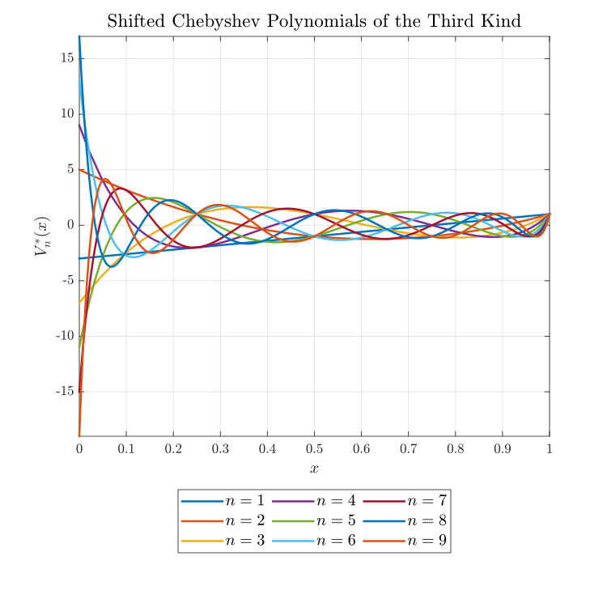

# Classical Orthogonal Polynomials
Jacobi, Gegenbauer, Chebyshev of first, second, third, fourth kind, Legendre, Laguerre, Hermite, shifted Chebyshev and Legendre polynomials using MATLAB.

## Table of Contents

- [Definitions](#definitions)
- [Jacobi polynomials](#jacobi-polynomials)
	- [Chebyshev polynomials of the first kind](#chebyshev-polynomials-of-the-first-kind)
	- [Chebyshev polynomials of the second kind](#chebyshev-polynomials-of-the-second-kind)
	- [Chebyshev polynomials of the third kind](#chebyshev-polynomials-of-the-third-kind)
	- [Chebyshev polynomials of the fourth kind](#chebyshev-polynomials-of-the-fourth-kind)
	- [Gegenbauer polynomials](#gegenbauer-polynomials)
	- [Legendre polynomials](#legendre-polynomials)
	- [Shifted Chebyshev polynomials of the first kind](#shifted-chebyshev-polynomials-of-the-first-kind)
	- [Shifted Chebyshev polynomials of the second kind](#shifted-chebyshev-polynomials-of-the-second-kind)
	- [Shifted Chebyshev polynomials of the third kind](#shifted-chebyshev-polynomials-of-the-third-kind)
	- [Shifted Chebyshev polynomials of the fourth kind](#shifted-chebyshev-polynomials-of-the-fourth-kind)
	- [Shifted Gegenbauer polynomials](#shifted-gegenbauer-polynomials)
	- [Shifted Legendre polynomials](#shifted-legendre-polynomials)
- [Laguerre Polynomials](#laguerre-polynomials)
- [References](#references)

## Definitions

**Orthogonality on intervals.** A set of polynomials $\lbrace p_n(x)\rbrace_{n=0}^{\infty}$ is said to be orthogonal on $\left(a,b\right)$ with respect to the weight function $\omega\left(x\right)\geq0$ if
$$\int_a^bp_n\left(x\right)p_m\left(x\right)\omega\left(x\right)\mathrm{d}x=\delta_{mn}h_n.$$

**Orthonormality on intervals.** A set of polynomials $\left\lbrace p_n\left(x\right)\right\rbrace_{n=0}^{\infty}$ is said to be orthonormal on $\left(a,b\right)$ with respect to the weight function $\omega\left(x\right)\geq0$ if
$$\int_a^bp_n\left(x\right)p_m\left(x\right)\omega\left(x\right)\mathrm{d}x=\delta_{nm},$$
where $\delta_{nm}$ is Kronecker delta.

**Recurrence relations.** Assume that $p_{-1}\left(x\right)\equiv0$, then
$$p_{n+1}\left(x\right)=\left(A_nx+B_n\right)p_n\left(x\right)-C_np_{n-1}\left(x\right),$$
here $A_n,B_n\left(n\geq 0\right)$, and $C_n\left(n\geq 1\right)$ are real constants.

**Rodrigues' formula.** Orthogonal polynomials can be expressed through Rodrigue's formula, which gives an analytic expression for polynomials through derivatives:
$$p_{n}(x)=\frac{1}{\kappa_{n}\omega(x)}\frac{{\mathrm{d}}^{n}}{{\mathrm{d}x}^{n}}\left[\omega(x)(F(x))^{n}\right].$$

**Pochhammer Symbol & Falling Factorial**

$$
\left(x\right)_n\equiv\frac{\Gamma\left(x+n\right)}{\Gamma\left(x\right)}, \quad n\geq0.
$$

| Name                               | $p_n(x)$                                    | $(a,b)$           | $\omega(x)$                                   | $h_n$                                                                                                        | $F(x)$    | $\kappa_n$            |
|------------------------------------|---------------------------------------------|-------------------|-----------------------------------------------|--------------------------------------------------------------------------------------------------------------|-----------|-----------------------|
| Jacobi                             | $P_n^{(\alpha,\beta)}(x)$                  | $(-1,1)$          | $(1-x)^\alpha(1+x)^\beta$                    | $\frac{2^{\alpha +\beta +1}}{2n+\alpha +\beta +1}\frac{\Gamma(n+\alpha +1)\Gamma(n+\beta +1)}{\Gamma(n+\alpha +\beta +1)n!}$                                      | $1 - x^2$ | $(-2)^n n!$           |
| Gegenbauer                         | $C_n^{(\lambda)}(x)$                       | $(-1,1)$          | $(1-x^2)^{\lambda-1/2}$                      | $\frac{2^{1-2\lambda}\pi\Gamma(n+2\lambda)}{(n+\lambda)(\Gamma(\lambda))^2n!}$                              | $1 - x^2$ | $\frac{(-2)^n (\lambda + \frac{1}{2})_n n!}{(2\lambda)_n}$ |
| Chebyshev of first kind           | $T_n(x)$                                    | $(-1,1)$          | $(1-x^2)^{-1/2}$                             | $\frac{\pi}{2}, n>0$                                                                                         | $1 - x^2$ | $\frac{(-2)^n (\frac{1}{2})_n}{n}$                     |
| Chebyshev of second kind          | $U_n(x)$                                    | $(-1,1)$          | $(1-x^2)^{1/2}$                              | $\frac{\pi}{2}$                                                                                               | $1 - x^2$ | $\frac{(-2)^n (\frac{3}{2})_n}{n + 1}$                 |
| Chebyshev of third kind           | $V_n(x)$                                    | $(-1,1)$          | $(1-x)^{-1/2}(1+x)^{1/2}$                    | $\pi$                                                                                                         | $1 - x^2$ | $\frac{(-2)^n (\frac{1}{2})_n}{n}$                     |
| Chebyshev of fourth kind          | $W_n(x)$                                    | $(-1,1)$          | $(1-x)^{1/2}(1+x)^{-1/2}$                    | $\pi$                                                                                                         | $1 - x^2$ | $\frac{(-2)^n (\frac{3}{2})_n}{2n + 1}$               |
| Legendre                           | $P_n(x)$                                    | $(-1,1)$          | $1$                                           | $\frac{2}{2n+1}$                                                                                              | $1 - x^2$ | $(-2)^n n!$                                           |
| Laguerre                           | $L_n^{(\alpha)}(x)$                        | $(0,\infty)$      | $x^\alpha \mathrm{e}^{-x}$                            | $\frac{\Gamma(n+\alpha+1)}{n!}$                                                                              | $x$       | $n!$                                                  |
| Hermite                            | $H_n(x)$                                    | $(-\infty,\infty)$| $\mathrm{e}^{-x^2}$                                   | $\sqrt{\pi}2^nn!$                                                                                            | $1$       | $(-1)^n$                                              |
| Hermite                            | $He_n(x)$                                   | $(-\infty,\infty)$| $\mathrm{e}^{-\frac{1}{2}x^2}$                       | $\sqrt{2\pi}n!$                                                                                              | $1$       | $(-1)^n$                                              |

## Jacobi polynomials
The Jacobi polynomials $p_n\left(x\right)=P_{n}^{(\alpha ,\beta )}\left(x\right)$ are a class of orthogonal polynomials orthogonal on an interval $\left(-1,1\right)$ with a weight function $\omega\left(x\right)=\left(1-x\right)^\alpha\left(1+x\right)^\beta$. Gegenbauer, Chebyshev polynomials of all kinds and Legendre polynomials are special cases of Jacobi polynomials.

**Definition.** For $z\in\mathbb{C}$ Jacobi polynomials can be defined as
$$P_{n}^{(\alpha ,\beta )}(z)={\frac {\Gamma (\alpha +n+1)}{n!\Gamma (\alpha +\beta +n+1)}}\sum _{m=0}^{n}{n \choose m}{\frac {\Gamma (\alpha +\beta +n+m+1)}{\Gamma (\alpha +m+1)}}\left({\frac {z-1}{2}}\right)^{m}.$$

For $x\in\mathbb{R}$ Jacobi polynomials can be defined as
$$P_{n}^{(\alpha ,\beta )}(x)=\sum _{s=0}^{n}{n+\alpha  \choose n-s}{n+\beta  \choose s}\left({\frac {x-1}{2}}\right)^{s}\left({\frac {x+1}{2}}\right)^{n-s}.$$

Another representation can be obtained using the Rodrigues' formula:
$$P_{n}^{(\alpha ,\beta )}(x)=\frac{1}{\left(-2\right)^nn!}\left(1-x\right)^{-\alpha}\left(1+x\right)^{-\beta}\frac{{\mathrm{d}}^{n}}{{\mathrm{d}x}^{n}}\left[\left(1-x\right)^\alpha\left(1+x\right)^\beta\left(1-x^2\right)^{n}\right],$$
here for Jacobi polynomials $\kappa_{n}=\left(-2\right)^nn!, F\left(x\right)=\left(1-x^2\right).$

**Recurrence relations.** 

$$P_{n+1}^{(\alpha ,\beta )}(x)=(A_{n}x+B_{n})P_{n}^{(\alpha ,\beta )}-C_{n}P_{n-1}^{(\alpha ,\beta )},$$

where 

$$\begin{align*}
    A_{n}&=\frac{(2n+\alpha+\beta+1)(2n+\alpha+\beta+2)}{2(n+1)(n+\alpha+\beta+1)},\\
    B_{n}&=\frac{(\alpha^{2}-\beta^{2})(2n+\alpha+\beta+1)}{2(n+1)(n+\alpha+\beta+1)(2n+\alpha+\beta)},\\
    C_{n}&=\frac{(n+\alpha)(n+\beta)(2n+\alpha+\beta+2)}{(n+1)(n+\alpha+\beta+1)(2n+\alpha+\beta)},
\end{align*}$$

with

$$\begin{align*}
   P_{0}^{(\alpha ,\beta )}(x)&=1,\\
   P_{1}^{(\alpha ,\beta )}(x)&=A_0x+B_0.
\end{align*}$$

**Orthogonality.** 

$$\int_{-1}^{1}P_{m}^{\left(\alpha ,\beta\right)}\left(x\right)P_{n}^{(\alpha ,\beta )}\left(x\right)\omega\left(x\right)\mathrm{d}x=\int_{-1}^{1}\left[P_{n}^{\left(\alpha ,\beta\right)}\left(x\right)\right]^2\omega\left(x\right)\mathrm{d}x={\frac {2^{\alpha +\beta +1}}{2n+\alpha +\beta +1}}{\frac {\Gamma (n+\alpha +1)\Gamma (n+\beta +1)}{\Gamma (n+\alpha +\beta +1)n!}}\delta _{nm},\quad \alpha,\beta >-1.$$

**Special values.**
$$P_n^{\left(\alpha,\beta\right)}\left(1\right)=\binom{n+\alpha}{n}=\frac{\Gamma\left(n+\alpha+1\right)}{\Gamma\left(\alpha+1\right)\Gamma\left(n+1\right)}.$$

### Chebyshev polynomials of the first kind
$$T_n(x)=\frac{P_n^{(-1/2,-1/2)}(x)}{P_n^{(-1/2,-1/2)}(1)}=\frac{2^{2n}(n!)^2}{(2n)!}P_n^{(-1/2,-1/2)}(x)=\cos{(n\arccos x)}=\det\left[ \begin{array}{cccccc}
x & 1 & & & \\
1 & 2x & 1 & &  \\
& 1 & \ddots & \ddots &\\
& & \ddots & \ddots & 1\\
 & & &1 &2x
\end{array}\right]_{n\times n}.$$

$$\begin{align*}
    T_{0}(x)&=1,\\
    T_{1}(x)&=x,\\
    T_{2}(x)&=2x^2-1,\\
    T_{3}(x)&=4x^3-3x,\\
    T_{4}(x)&=8x^4-8x^2+1,\\
    T_{5}(x)&=16x^5-20x^3+5x,\\
    T_{6}(x)&=32x^6-48x^4+18x^2-1,\\
    T_{7}(x)&=64x^7-112x^5+56x^3-7x,\\
    T_{8}(x)&=128x^8-256x^6+160x^4-32x^2+1,\\
    T_{9}(x)&=256x^9-576x^7+432x^5-120x^3+9x,\\
    T_{10}(x)&=512x^{10}-1280x^8+1120x^6-400x^4+50x^2-1.
\end{align*}$$

  

### Chebyshev polynomials of the second kind
$$U_n(x)=(n+1)\frac{P_n^{(1/2,1/2)}(x)}{P_n^{(1/2,1/2)}(1)}=\frac{2^{2n}n!(n+1)!}{(2n+1)!}P_n^{(1/2,1/2)}(x)=\frac{\sin{((n+1)\arccos x})}{\sin(\arccos x)}=\det\left[ \begin{array}{cccccc}
2x & 1 & & & \\
1 & 2x & 1 & &  \\
& 1 & \ddots & \ddots &\\
& & \ddots & \ddots & 1\\
 & & &1 &2x
\end{array}\right]_{n\times n}.$$

$$\begin{align*}
    U_{0}(x)&=1,\\
    U_{1}(x)&=2x,\\
    U_{2}(x)&=4x^2-1,\\
    U_{3}(x)&=8x^3-4x,\\
    U_{4}(x)&=16x^4-12x^2+1,\\
    U_{5}(x)&=32x^5-32x^3+6x,\\
    U_{6}(x)&=64x^6-80x^4+24x^2-1,\\
    U_{7}(x)&=128x^7-192x^5+80x^3-8x,\\
    U_{8}(x)&=256x^8-448x^6+240x^4-40x^2+1,\\
    U_{9}(x)&=512x^9-1024x^7+672x^5-160x^3+10x,\\
    U_{10}(x)&=1024x^{10}-2304x^8+1792x^6-560x^4+60x^2-1.
\end{align*}$$

  

### Chebyshev polynomials of the third kind
$$V_n(x) =\frac{P_n^{(-1/2,1/2)}(x)}{P_n^{(-1/2,1/2)}(1)}=\frac{2^{2n}(n!)^2}{(2n)!}P_n^{(-1/2,1/2)}(x)= \frac{\cos{\left(\left(n+\frac{1}{2}\right)\arccos x\right)}}{\cos{\left(\frac{1}{2}\arccos x\right)}}.$$

$$\begin{align*}
    V_{0}(x)&=1,\\
    V_{1}(x)&=2x-1,\\
    V_{2}(x)&=4x^2-2x-1,\\
    V_{3}(x)&=8x^3-4x^2-4x+1,\\
    V_{4}(x)&=16x^4-8x^3-12x^2+4x+1,\\
    V_{5}(x)&=32x^5-16x^4-32x^3+12x^2+6x-1,\\
    V_{6}(x)&=64x^6-32x^5-80x^4+32x^3+24x^2-6x-1,\\
    V_{7}(x)&=128x^7-64x^6-192x^5+80x^4+80x^3-24x^2-8x+1,\\
    V_{8}(x)&=256x^8-128x^7-448x^6+192x^5+240x^4-80x^3-40x^2+8x+1,\\
    V_{9}(x)&=512x^9-256x^8-1024x^7+448x^6+672x^5-240x^4-160x^3+40x^2+10x-1,\\
    V_{10}(x)&=1024x^{10}-512x^9-2304x^8+1024x^7+1792x^6-672x^5-560x^4+160x^3+60x^2-10x-1.
\end{align*}$$

  

### Chebyshev polynomials of the fourth kind
$$W_n(x) =(2n+1)\frac{P_n^{(1/2,-1/2)}(x)}{P_n^{(1/2,-1/2)}(1)}=\frac{2^{2n}\left(n!\right)^2}{\left(2n\right)!}P_n^{(1/2,-1/2)}(x)= \frac{\sin{\left(\left(n+\frac{1}{2}\right)\arccos x\right)}}{\sin{\left(\frac{1}{2}\arccos x\right)}}.$$

$$\begin{align*}
    W_{0}(x)&=1,\\
    W_{1}(x)&=2x+1,\\
    W_{2}(x)&=4x^2+2x-1,\\
    W_{3}(x)&=8x^3+4x^2-4x-1,\\
    W_{4}(x)&=16x^4+8x^3-12x^2-4x+1,\\
    W_{5}(x)&=32x^5+16x^4-32x^3-12x^2+6x+1,\\
    W_{6}(x)&=64x^6+32x^5-80x^4-32x^3+24x^2+6x-1,\\
    W_{7}(x)&=128x^7+64x^6-192x^5-80x^4+80x^3+24x^2-8x-1,\\
    W_{8}(x)&=256x^8+128x^7-448x^6-192x^5+240x^4+80x^3-40x^2-8x+1,\\
    W_{9}(x)&=512x^9+256x^8-1024x^7-448x^6+672x^5+240x^4-160x^3-40x^2+10x+1,\\
    W_{10}(x)&=1024x^{10}+512x^9-2304x^8-1024x^7+1792x^6+672x^5-560x^4-160x^3+60x^2+10x-1.
\end{align*}$$

  

	

### Gegenbauer polynomials

$$
C_n^{(\lambda)}(x)=\frac{\left(2\lambda\right)_n}{\left(\lambda+\frac{1}{2}\right)_n}P_n^{(\lambda-1/2,\lambda-1/2)}(x)=\frac{\Gamma\left(\lambda+\frac{1}{2}\right)}{\Gamma\left(2\lambda\right)}\frac{\Gamma\left(2\lambda+n\right)}{\Gamma\left(\lambda+n+\frac{1}{2}\right)}P_n^{(\lambda-1/2,\lambda-1/2)}(x).
$$

$$
\begin{align*}
    C_{0}^{(1)}(x)&=1,\\
    C_{1}^{(1)}(x)&=2x,\\
    C_{2}^{(1)}(x)&=4x^2-1,\\
    C_{3}^{(1)}(x)&=8x^3-4x,\\
    C_{4}^{(1)}(x)&=16x^4-12x^2+1,\\
    C_{5}^{(1)}(x)&=32x^5-32x^3+6x,\\
    C_{6}^{(1)}(x)&=64x^6-80x^4+24x^2-1,\\
    C_{7}^{(1)}(x)&=128x^7-192x^5+80x^3-8x,\\
    C_{8}^{(1)}(x)&=256x^8-448x^6+240x^4-40x^2+1,\\
    C_{9}^{(1)}(x)&=512x^9-1024x^7+672x^5-160x^3+10x,\\
    C_{10}^{(1)}(x)&=1024x^{10}-2304x^8+1792x^6-560x^4+60x^2-1.
\end{align*}
$$

  

$$\begin{align*}
    C_{0}^{(2)}(x)&=1,\\
    C_{1}^{(2)}(x)&=4x,\\
    C_{2}^{(2)}(x)&=12x^2-2,\\
    C_{3}^{(2)}(x)&=32x^3-12x,\\
    C_{4}^{(2)}(x)&=80x^4-48x^2+3,\\
    C_{5}^{(2)}(x)&=192x^5-160x^3+24x,\\
    C_{6}^{(2)}(x)&=448x^6-480x^4+120x^2-4,\\
    C_{7}^{(2)}(x)&=1024x^7-1344x^5+480x^3-40x,\\
    C_{8}^{(2)}(x)&=2304x^8-3584x^6+1680x^4-240x^2+5,\\
    C_{9}^{(2)}(x)&=5120x^9-9216x^7+5376x^5-1120x^3+60x,\\
    C_{10}^{(2)}(x)&=11264x^{10}-23040x^8+16128x^6-4480x^4+420x^2-6.
\end{align*}$$

  

$$\begin{align*}
    C_{0}^{(3)}(x)&=1,\\
    C_{1}^{(3)}(x)&=6x,\\
    C_{2}^{(3)}(x)&=24x^2-3,\\
    C_{3}^{(3)}(x)&=80x^3-24x,\\
    C_{4}^{(3)}(x)&=240x^4-120x^2+6,\\
    C_{5}^{(3)}(x)&=672x^5-480x^3+60x,\\
    C_{6}^{(3)}(x)&=1792x^6-1680x^4+360x^2-10,\\
    C_{7}^{(3)}(x)&=4608x^7-5376x^5+1680x^3-120x,\\
    C_{8}^{(3)}(x)&=11520x^8-16128x^6+6720x^4-840x^2+15,\\
    C_{9}^{(3)}(x)&=28160x^9-46080x^7+24192x^5-4480x^3+210x,\\
    C_{10}^{(3)}(x)&=67584x^{10}-126720x^8+80640x^6-20160x^4+1680x^2-21.
\end{align*}$$

  

$$\begin{align*}
    C_{0}^{(4)}(x)&=1,\\
    C_{1}^{(4)}(x)&=8x,\\
    C_{2}^{(4)}(x)&=40x^2-4,\\
    C_{3}^{(4)}(x)&=160x^3-40x,\\
    C_{4}^{(4)}(x)&=560x^4-240x^2+10,\\
    C_{5}^{(4)}(x)&=1792x^5-1120x^3+120x,\\
    C_{6}^{(4)}(x)&=5376x^6-4480x^4+840x^2-20,\\
    C_{7}^{(4)}(x)&=15360x^7-16128x^5+4480x^3-280x,\\
    C_{8}^{(4)}(x)&=42240x^8-53760x^6+20160x^4-2240x^2+35,\\
    C_{9}^{(4)}(x)&=112640x^9-168960x^7+80640x^5-13440x^3+560x,\\
    C_{10}^{(4)}(x)&=292864x^{10}-506880x^8+295680x^6-67200x^4+5040x^2-56.
\end{align*}$$

  

$$\begin{align*}
    C_{0}^{(5)}(x)&=1,\\
    C_{1}^{(5)}(x)&=10x,\\
    C_{2}^{(5)}(x)&=60x^2-5,\\
    C_{3}^{(5)}(x)&=280x^3-60x,\\
    C_{4}^{(5)}(x)&=1120x^4-420x^2+15,\\
    C_{5}^{(5)}(x)&=4032x^5-2240x^3+210x,\\
    C_{6}^{(5)}(x)&=13440x^6-10080x^4+1680x^2-35,\\
    C_{7}^{(5)}(x)&=42240x^7-40320x^5+10080x^3-560x,\\
    C_{8}^{(5)}(x)&=126720x^8-147840x^6+50400x^4-5040x^2+70,\\
    C_{9}^{(5)}(x)&=366080x^9-506880x^7+221760x^5-33600x^3+1260x,\\
    C_{10}^{(5)}(x)&=1025024x^{10}-1647360x^8+887040x^6-184800x^4+12600x^2-126.
\end{align*}$$

  

$$\begin{align*}
    C_{0}^{(6)}(x)&=1,\\
    C_{1}^{(6)}(x)&=12x,\\
    C_{2}^{(6)}(x)&=84x^2-6,\\
    C_{3}^{(6)}(x)&=448x^3-84x,\\
    C_{4}^{(6)}(x)&=2016x^4-672x^2+21,\\
    C_{5}^{(6)}(x)&=8064x^5-4032x^3+336x,\\
    C_{6}^{(6)}(x)&=29568x^6-20160x^4+3024x^2-56,\\
    C_{7}^{(6)}(x)&=101376x^7-88704x^5+20160x^3-1008x,\\
    C_{8}^{(6)}(x)&=329472x^8-354816x^6+110880x^4-10080x^2+126,\\
    C_{9}^{(6)}(x)&=1025024x^9-1317888x^7+532224x^5-73920x^3+2520x,\\
    C_{10}^{(6)}(x)&=3075072x^{10}-4612608x^8+2306304x^6-443520x^4+27720x^2-252.
\end{align*}$$

  

$$\begin{align*}
    C_{0}^{(7)}(x)&=1,\\
    C_{1}^{(7)}(x)&=14x,\\
    C_{2}^{(7)}(x)&=112x^2-7,\\
    C_{3}^{(7)}(x)&=672x^3-112x,\\
    C_{4}^{(7)}(x)&=3360x^4-1008x^2+28,\\
    C_{5}^{(7)}(x)&=14784x^5-6720x^3+504x,\\
    C_{6}^{(7)}(x)&=59136x^6-36960x^4+5040x^2-84,\\
    C_{7}^{(7)}(x)&=219648x^7-177408x^5+36960x^3-1680x,\\
    C_{8}^{(7)}(x)&=768768x^8-768768x^6+221760x^4-18480x^2+210,\\
    C_{9}^{(7)}(x)&=2562560x^9-3075072x^7+1153152x^5-147840x^3+4620x,\\
    C_{10}^{(7)}(x)&=8200192x^{10}-11531520x^8+5381376x^6-960960x^4+55440x^2-462.
\end{align*}$$

  

$$\begin{align*}
    C_{0}^{(8)}(x)&=1,\\
    C_{1}^{(8)}(x)&=16x,\\
    C_{2}^{(8)}(x)&=144x^2-8,\\
    C_{3}^{(8)}(x)&=960x^3-144x,\\
    C_{4}^{(8)}(x)&=5280x^4-1440x^2+36,\\
    C_{5}^{(8)}(x)&=25344x^5-10560x^3+720x,\\
    C_{6}^{(8)}(x)&=109824x^6-63360x^4+7920x^2-120,\\
    C_{7}^{(8)}(x)&=439296x^7-329472x^5+63360x^3-2640x,\\
    C_{8}^{(8)}(x)&=1647360x^8-1537536x^6+411840x^4-31680x^2+330,\\
    C_{9}^{(8)}(x)&=5857280x^9-6589440x^7+2306304x^5-274560x^3+7920x,\\
    C_{10}^{(8)}(x)&=19914752x^{10}-26357760x^8+11531520x^6-1921920x^4+102960x^2-792.
\end{align*}$$

  

$$\begin{align*}
    C_{0}^{(9)}(x)&=1,\\
    C_{1}^{(9)}(x)&=18x,\\
    C_{2}^{(9)}(x)&=180x^2-9,\\
    C_{3}^{(9)}(x)&=1320x^3-180x,\\
    C_{4}^{(9)}(x)&=7920x^4-1980x^2+45,\\
    C_{5}^{(9)}(x)&=41184x^5-15840x^3+990x,\\
    C_{6}^{(9)}(x)&=192192x^6-102960x^4+11880x^2-165,\\
    C_{7}^{(9)}(x)&=823680x^7-576576x^5+102960x^3-3960x,\\
    C_{8}^{(9)}(x)&=3294720x^8-2882880x^6+720720x^4-51480x^2+495,\\
    C_{9}^{(9)}(x)&=12446720x^9-13178880x^7+4324320x^5-480480x^3+12870x,\\
    C_{10}^{(9)}(x)&=44808192x^{10}-56010240x^8+23063040x^6-3603600x^4+180180x^2-1287.
\end{align*}$$

  

$$\begin{align*}
    C_{0}^{(10)}(x)&=1,\\
    C_{1}^{(10)}(x)&=20x,\\
    C_{2}^{(10)}(x)&=220x^2-10,\\
    C_{3}^{(10)}(x)&=1760x^3-220x,\\
    C_{4}^{(10)}(x)&=11440x^4-2640x^2+55,\\
    C_{5}^{(10)}(x)&=64064x^5-22880x^3+1320x,\\
    C_{6}^{(10)}(x)&=320320x^6-160160x^4+17160x^2-220,\\
    C_{7}^{(10)}(x)&=1464320x^7-960960x^5+160160x^3-5720x,\\
    C_{8}^{(10)}(x)&=6223360x^8-5125120x^6+1201200x^4-80080x^2+715,\\
    C_{9}^{(10)}(x)&=24893440x^9-24893440x^7+7687680x^5-800800x^3+20020x,\\
    C_{10}^{(10)}(x)&=94595072x^{10}-112020480x^8+43563520x^6-6406400x^4+300300x^2-2002.   
\end{align*}$$

  

### Legendre polynomials
$$P_n(x)=P_{n}^{(0,0)}(x).$$

$$\begin{align*}
    P_{0}(x)&=1,\\
    P_{1}(x)&=x,\\
    P_{2}(x)&=\frac{3x^2}{2}-\frac{1}{2},\\
    P_{3}(x)&=\frac{5x^3}{2}-\frac{3x}{2},\\
    P_{4}(x)&=\frac{35x^4}{8}-\frac{15x^2}{4}+\frac{3}{8},\\
    P_{5}(x)&=\frac{63x^5}{8}-\frac{35x^3}{4}+\frac{15x}{8},\\
    P_{6}(x)&=\frac{231x^6}{16}-\frac{315x^4}{16}+\frac{105x^2}{16}-\frac{5}{16},\\
    P_{7}(x)&=\frac{429x^7}{16}-\frac{693x^5}{16}+\frac{315x^3}{16}-\frac{35x}{16},\\
    P_{8}(x)&=\frac{6435x^8}{128}-\frac{3003x^6}{32}+\frac{3465x^4}{64}-\frac{315x^2}{32}+\frac{35}{128},\\
    P_{9}(x)&=\frac{12155x^9}{128}-\frac{6435x^7}{32}+\frac{9009x^5}{64}-\frac{1155x^3}{32}+\frac{315x}{128},\\
    P_{10}(x)&=\frac{46189x^{10}}{256}-\frac{109395x^8}{256}+\frac{45045x^6}{128}-\frac{15015x^4}{128}+\frac{3465x^2}{256}-\frac{63}{256}.
\end{align*}$$

  

	

### Shifted Chebyshev polynomials of the first kind

$$T_n^\ast(x)=T_n(2x-1)$$

$$\begin{align*}
    T_{0}^\ast(x)&=1,\\
    T_{1}^\ast(x)&=2x-1,\\
    T_{2}^\ast(x)&=8x^2-8x+1,\\
    T_{3}^\ast(x)&=32x^3-48x^2+18x-1,\\
    T_{4}^\ast(x)&=128x^4-256x^3+160x^2-32x+1,\\
    T_{5}^\ast(x)&=512x^5-1280x^4+1120x^3-400x^2+50x-1,\\
    T_{6}^\ast(x)&=2048x^6-6144x^5+6912x^4-3584x^3+840x^2-72x+1,\\
    T_{7}^\ast(x)&=8192x^7-28672x^6+39424x^5-26880x^4+9408x^3-1568x^2+98x-1,\\
    T_{8}^\ast(x)&=32768x^8-131072x^7+212992x^6-180224x^5+84480x^4-21504x^3+2688x^2-128x+1,\\
    T_{9}^\ast(x)&=131072x^9-589824x^8+1105920x^7-1118208x^6+658944x^5-228096x^4+44352x^3-4320x^2+162x-1,\\
    T_{10}^\ast(x)&=524288x^{10}-2621440x^9+5570560x^8-6553600x^7+4659200x^6-2050048x^5+549120x^4-84480x^3+6600x^2-200x+1.
\end{align*}$$

  

	

### Shifted Chebyshev polynomials of the second kind

$$U_n^\ast(x)=U_n(2x-1)$$

$$\begin{align*}
    U_{0}^\ast(x)&=1,\\
    U_{1}^\ast(x)&=4x-2,\\
    U_{2}^\ast(x)&=16x^2-16x+3,\\
    U_{3}^\ast(x)&=64x^3-96x^2+40x-4,\\
    U_{4}^\ast(x)&=256x^4-512x^3+336x^2-80x+5,\\
    U_{5}^\ast(x)&=1024x^5-2560x^4+2304x^3-896x^2+140x-6,\\
    U_{6}^\ast(x)&=4096x^6-12288x^5+14080x^4-7680x^3+2016x^2-224x+7,\\
    U_{7}^\ast(x)&=16384x^7-57344x^6+79872x^5-56320x^4+21120x^3-4032x^2+336x-8,\\
    U_{8}^\ast(x)&=65536x^8-262144x^7+430080x^6-372736x^5+183040x^4-50688x^3+7392x^2-480x+9,\\
    U_{9}^\ast(x)&=262144x^9-1179648x^8+2228224x^7-2293760x^6+1397760x^5-512512x^4+109824x^3-12672x^2+660x-10,\\
    U_{10}^\ast(x)&=1048576x^{10}-5242880x^9+11206656x^8-13369344x^7+9748480x^6-4472832x^5+1281280x^4-219648x^3+20592x^2-880x+11.
\end{align*}$$

  

		

### Shifted Chebyshev polynomials of the third kind

$$V_n^\ast(x)=V_n(2x-1)$$

$$\begin{align*}
    V_{0}^\ast(x)&=1,\\
    V_{1}^\ast(x)&=4x-3,\\
    V_{2}^\ast(x)&=16x^2-20x+5,\\
    V_{3}^\ast(x)&=64x^3-112x^2+56x-7,\\
    V_{4}^\ast(x)&=256x^4-576x^3+432x^2-120x+9,\\
    V_{5}^\ast(x)&=1024x^5-2816x^4+2816x^3-1232x^2+220x-11,\\
    V_{6}^\ast(x)&=4096x^6-13312x^5+16640x^4-9984x^3+2912x^2-364x+13,\\
    V_{7}^\ast(x)&=16384x^7-61440x^6+92160x^5-70400x^4+28800x^3-6048x^2+560x-15,\\
    V_{8}^\ast(x)&=65536x^8-278528x^7+487424x^6-452608x^5+239360x^4-71808x^3+11424x^2-816x+17,\\
    V_{9}^\ast(x)&=262144x^9-1245184x^8+2490368x^7-2723840x^6+1770496x^5-695552x^4+160512x^3-20064x^2+1140x-19,\\
    V_{10}^\ast(x)&=1048576x^{10}-5505024x^9+12386304x^8-15597568x^7+12042240x^6-5870592x^5+1793792x^4-329472x^3+33264x^2-1540x+21.
\end{align*}$$

  

			

### Shifted Chebyshev polynomials of the fourth kind

$$W_n^\ast(x)=W_n(2x-1)$$

$$\begin{align*}
    W_{0}^\ast(x)&=1,\\
    W_{1}^\ast(x)&=4x-1,\\
    W_{2}^\ast(x)&=16x^2-12x+1,\\
    W_{3}^\ast(x)&=64x^3-80x^2+24x-1,\\
    W_{4}^\ast(x)&=256x^4-448x^3+240x^2-40x+1,\\
    W_{5}^\ast(x)&=1024x^5-2304x^4+1792x^3-560x^2+60x-1,\\
    W_{6}^\ast(x)&=4096x^6-11264x^5+11520x^4-5376x^3+1120x^2-84x+1,\\
    W_{7}^\ast(x)&=16384x^7-53248x^6+67584x^5-42240x^4+13440x^3-2016x^2+112x-1,\\
    W_{8}^\ast(x)&=65536x^8-245760x^7+372736x^6-292864x^5+126720x^4-29568x^3+3360x^2-144x+1,\\
    W_{9}^\ast(x)&=262144x^9-1114112x^8+1966080x^7-1863680x^6+1025024x^5-329472x^4+59136x^3-5280x^2+180x-1,\\
    W_{10}^\ast(x)&=1048576x^{10}-4980736x^9+10027008x^8-11141120x^7+7454720x^6-3075072x^5+768768x^4-109824x^3+7920x^2-220x+1.
\end{align*}$$

  

		

### Shifted Gegenbauer polynomials

### Shifted Legendre polynomials

$$P_n^\ast(x)=P_n(2x-1)$$

$$\begin{align*}
    P_{0}^\ast(x)&=1,\\
    P_{1}^\ast(x)&=2x-1,\\
    P_{2}^\ast(x)&=6x^2-6x+1,\\
    P_{3}^\ast(x)&=20x^3-30x^2+12x-1,\\
    P_{4}^\ast(x)&=70x^4-140x^3+90x^2-20x+1,\\
    P_{5}^\ast(x)&=252x^5-630x^4+560x^3-210x^2+30x-1,\\
    P_{6}^\ast(x)&=924x^6-2772x^5+3150x^4-1680x^3+420x^2-42x+1,\\
    P_{7}^\ast(x)&=3432x^7-12012x^6+16632x^5-11550x^4+4200x^3-756x^2+56x-1,\\
    P_{8}^\ast(x)&=12870x^8-51480x^7+84084x^6-72072x^5+34650x^4-9240x^3+1260x^2-72x+1,\\
    P_{9}^\ast(x)&=48620x^9-218790x^8+411840x^7-420420x^6+252252x^5-90090x^4+18480x^3-1980x^2+90x-1,\\
    P_{10}^\ast(x)&=184756x^{10}-923780x^9+1969110x^8-2333760x^7+1681680x^6-756756x^5+210210x^4-34320x^3+2970x^2-110x+1.
\end{align*}$$

  

## Laguerre Polynomials	
The Laguerre polynomials $p_n\left(x\right)=L_{n}^{(\alpha)}\left(x\right)$ are a class of orthogonal polynomials orthogonal on an interval $\left(0,\infty\right)$ with a weight function $\omega\left(x\right)=x^\alpha\mathrm{e}^{-x}$.

**Definition.** The Laguerre polynomials are defined via Rodrigues' formula:

$$
L_n^{\left(\alpha\right)}\left(x\right)=\frac{\mathrm{e}^{x}}{n!x^{\alpha}}\frac{{\mathrm{d}}^{n}}{{\mathrm{d}x}^{n}}\left[x^{n+\alpha}\mathrm{e}^{-x}\right].
$$

**Recurrence relations.** 

$$
L_{n+1}^{\left(\alpha\right)}\left(x\right)=(A_{n}x+B_{n})L_n^{\left(\alpha\right)}\left(x\right)-C_{n}L_{n-1}^{\left(\alpha\right)}\left(x\right),
$$

where 

$$
\begin{align*}
    A_{n}&=-\frac{1}{n+1},\\
    B_{n}&=\frac{2n+\alpha+1}{n+1},\\
    C_{n}&=\frac{n+\alpha}{n+1},
\end{align*}
$$

with

$$
\begin{align*}
   L_0^{\left(\alpha\right)}\left(x\right)&=1,\\
   L_1^{\left(\alpha\right)}\left(x\right)&=A_0x+B_0.
\end{align*}
$$

**Orthogonality.** 

$$
\int\_{0}^{\infty}L^{(\alpha)}\_{m}(x)L^{(\alpha)}\_{n}(x)\omega(x)\mathrm{d}x=\frac{\Gamma(n+\alpha+1)}{n!}\delta\_{mn}.
$$

$$
\begin{align*}
    L_{0}^{(1)}(x)&=1,\\
    L_{1}^{(1)}(x)&=2-x,\\
    L_{2}^{(1)}(x)&=\frac{x^2}{2}-3x+3,\\
    L_{3}^{(1)}(x)&=-\frac{x^3}{6}+2x^2-6x+4,\\
    L_{4}^{(1)}(x)&=\frac{x^4}{24}-\frac{5x^3}{6}+5x^2-10x+5,\\
    L_{5}^{(1)}(x)&=-\frac{x^5}{120}+\frac{x^4}{4}-\frac{5x^3}{2}+10x^2-15x+6,\\
    L_{6}^{(1)}(x)&=\frac{x^6}{720}-\frac{7x^5}{120}+\frac{7x^4}{8}-\frac{35x^3}{6}+\frac{35x^2}{2}-21x+7,\\
    L_{7}^{(1)}(x)&=-\frac{x^7}{5040}+\frac{x^6}{90}-\frac{7x^5}{30}+\frac{7x^4}{3}-\frac{35x^3}{3}+28x^2-28x+8,\\
    L_{8}^{(1)}(x)&=\frac{x^8}{40320}-\frac{x^7}{560}+\frac{x^6}{20}-\frac{7x^5}{10}+\frac{21x^4}{4}-21x^3+42x^2-36x+9,\\
    L_{9}^{(1)}(x)&=-\frac{x^9}{362880}+\frac{x^8}{4032}-\frac{x^7}{112}+\frac{x^6}{6}-\frac{7x^5}{4}+\frac{21x^4}{2}-35x^3+60x^2-45x+10,\\
    L_{10}^{(1)}(x)&=\frac{x^{10}}{3628800}-\frac{11x^9}{362880}+\frac{11x^8}{8064}-\frac{11x^7}{336}+\frac{11x^6}{24}-\frac{77x^5}{20}+\frac{77x^4}{4}-55x^3+\frac{165x^2}{2}-55x+11.
\end{align*}
$$

  

$$
\begin{align*}
    L_{0}^{(2)}(x)&=1,\\
    L_{1}^{(2)}(x)&=3-x,\\
    L_{2}^{(2)}(x)&=\frac{x^2}{2}-4x+6,\\
    L_{3}^{(2)}(x)&=-\frac{x^3}{6}+\frac{5x^2}{2}-10x+10,\\
    L_{4}^{(2)}(x)&=\frac{x^4}{24}-x^3+\frac{15x^2}{2}-20x+15,\\
    L_{5}^{(2)}(x)&=-\frac{x^5}{120}+\frac{7x^4}{24}-\frac{7x^3}{2}+\frac{35x^2}{2}-35x+21,\\
    L_{6}^{(2)}(x)&=\frac{x^6}{720}-\frac{x^5}{15}+\frac{7x^4}{6}-\frac{28x^3}{3}+35x^2-56x+28,\\
    L_{7}^{(2)}(x)&=-\frac{x^7}{5040}+\frac{x^6}{80}-\frac{3x^5}{10}+\frac{7x^4}{2}-21x^3+63x^2-84x+36,\\
    L_{8}^{(2)}(x)&=\frac{x^8}{40320}-\frac{x^7}{504}+\frac{x^6}{16}-x^5+\frac{35x^4}{4}-42x^3+105x^2-120x+45,\\
    L_{9}^{(2)}(x)&=-\frac{x^9}{362880}+\frac{11x^8}{40320}-\frac{11x^7}{1008}+\frac{11x^6}{48}-\frac{11x^5}{4}+\frac{77x^4}{4}-77x^3+165x^2-165x+55,\\
    L_{10}^{(2)}(x)&=\frac{x^{10}}{3628800}-\frac{x^9}{30240}+\frac{11x^8}{6720}-\frac{11x^7}{252}+\frac{11x^6}{16}-\frac{33x^5}{5}+\frac{77x^4}{2}-132x^3+\frac{495x^2}{2}-220x+66.
\end{align*}
$$

  

$$
\begin{align*}
    L_{0}^{(3)}(x)&=1,\\
    L_{1}^{(3)}(x)&=4-x,\\
    L_{2}^{(3)}(x)&=\frac{x^2}{2}-5x+10,\\
    L_{3}^{(3)}(x)&=-\frac{x^3}{6}+3x^2-15x+20,\\
    L_{4}^{(3)}(x)&=\frac{x^4}{24}-\frac{7x^3}{6}+\frac{21x^2}{2}-35x+35,\\
    L_{5}^{(3)}(x)&=-\frac{x^5}{120}+\frac{x^4}{3}-\frac{14x^3}{3}+28x^2-70x+56,\\
    L_{6}^{(3)}(x)&=\frac{x^6}{720}-\frac{3x^5}{40}+\frac{3x^4}{2}-14x^3+63x^2-126x+84,\\
    L_{7}^{(3)}(x)&=-\frac{x^7}{5040}+\frac{x^6}{72}-\frac{3x^5}{8}+5x^4-35x^3+126x^2-210x+120,\\
    L_{8}^{(3)}(x)&=\frac{x^8}{40320}-\frac{11x^7}{5040}+\frac{11x^6}{144}-\frac{11x^5}{8}+\frac{55x^4}{4}-77x^3+231x^2-330x+165,\\
    L_{9}^{(3)}(x)&=-\frac{x^9}{362880}+\frac{x^8}{3360}-\frac{11x^7}{840}+\frac{11x^6}{36}-\frac{33x^5}{8}+33x^4-154x^3+396x^2-495x+220,\\
    L_{10}^{(3)}(x)&=\frac{x^{10}}{3628800}-\frac{13x^9}{362880}+\frac{13x^8}{6720}-\frac{143x^7}{2520}+\frac{143x^6}{144}-\frac{429x^5}{40}+\frac{143x^4}{2}-286x^3+\frac{1287x^2}{2}-715x+286.
\end{align*}
$$

  

$$
\begin{align*}
    L_{0}^{(4)}(x)&=1,\\
    L_{1}^{(4)}(x)&=5-x,\\
    L_{2}^{(4)}(x)&=\frac{x^2}{2}-6x+15,\\
    L_{3}^{(4)}(x)&=-\frac{x^3}{6}+\frac{7x^2}{2}-21x+35,\\
    L_{4}^{(4)}(x)&=\frac{x^4}{24}-\frac{4x^3}{3}+14x^2-56x+70,\\
    L_{5}^{(4)}(x)&=-\frac{x^5}{120}+\frac{3x^4}{8}-6x^3+42x^2-126x+126,\\
    L_{6}^{(4)}(x)&=\frac{x^6}{720}-\frac{x^5}{12}+\frac{15x^4}{8}-20x^3+105x^2-252x+210,\\
    L_{7}^{(4)}(x)&=-\frac{x^7}{5040}+\frac{11x^6}{720}-\frac{11x^5}{24}+\frac{55x^4}{8}-55x^3+231x^2-462x+330,\\
    L_{8}^{(4)}(x)&=\frac{x^8}{40320}-\frac{x^7}{420}+\frac{11x^6}{120}-\frac{11x^5}{6}+\frac{165x^4}{8}-132x^3+462x^2-792x+495,\\
    L_{9}^{(4)}(x)&=-\frac{x^9}{362880}+\frac{13x^8}{40320}-\frac{13x^7}{840}+\frac{143x^6}{360}-\frac{143x^5}{24}+\frac{429x^4}{8}-286x^3+858x^2-1287x+715,\\
    L_{10}^{(4)}(x)&=\frac{x^{10}}{3628800}-\frac{x^9}{25920}+\frac{13x^8}{5760}-\frac{13x^7}{180}+\frac{1001x^6}{720}-\frac{1001x^5}{60}+\frac{1001x^4}{8}-572x^3+\frac{3003x^2}{2}-2002x+1001.
\end{align*}
$$

  

$$
\begin{align*}
    L_{0}^{(5)}(x)&=1,\\
    L_{1}^{(5)}(x)&=6-x,\\
    L_{2}^{(5)}(x)&=\frac{x^2}{2}-7x+21,\\
    L_{3}^{(5)}(x)&=-\frac{x^3}{6}+4x^2-28x+56,\\
    L_{4}^{(5)}(x)&=\frac{x^4}{24}-\frac{3x^3}{2}+18x^2-84x+126,\\
    L_{5}^{(5)}(x)&=-\frac{x^5}{120}+\frac{5x^4}{12}-\frac{15x^3}{2}+60x^2-210x+252,\\
    L_{6}^{(5)}(x)&=\frac{x^6}{720}-\frac{11x^5}{120}+\frac{55x^4}{24}-\frac{55x^3}{2}+165x^2-462x+462,\\
    L_{7}^{(5)}(x)&=-\frac{x^7}{5040}+\frac{x^6}{60}-\frac{11x^5}{20}+\frac{55x^4}{6}-\frac{165x^3}{2}+396x^2-924x+792,\\
    L_{8}^{(5)}(x)&=\frac{x^8}{40320}-\frac{13x^7}{5040}+\frac{13x^6}{120}-\frac{143x^5}{60}+\frac{715x^4}{24}-\frac{429x^3}{2}+858x^2-1716x+1287,\\
    L_{9}^{(5)}(x)&=-\frac{x^9}{362880}+\frac{x^8}{2880}-\frac{13x^7}{720}+\frac{91x^6}{180}-\frac{1001x^5}{120}+\frac{1001x^4}{12}-\frac{1001x^3}{2}+1716x^2-3003x+2002,\\
    L_{10}^{(5)}(x)&=\frac{x^{10}}{3628800}-\frac{x^9}{24192}+\frac{x^8}{384}-\frac{13x^7}{144}+\frac{91x^6}{48}-\frac{1001x^5}{40}+\frac{5005x^4}{24}-\frac{2145x^3}{2}+\frac{6435x^2}{2}-5005x+3003.
\end{align*}
$$

  

$$
\begin{align*}
    L_{0}^{(6)}(x)&=1,\\
    L_{1}^{(6)}(x)&=7-x,\\
    L_{2}^{(6)}(x)&=\frac{x^2}{2}-8x+28,\\
    L_{3}^{(6)}(x)&=-\frac{x^3}{6}+\frac{9x^2}{2}-36x+84,\\
    L_{4}^{(6)}(x)&=\frac{x^4}{24}-\frac{5x^3}{3}+\frac{45x^2}{2}-120x+210,\\
    L_{5}^{(6)}(x)&=-\frac{x^5}{120}+\frac{11x^4}{24}-\frac{55x^3}{6}+\frac{165x^2}{2}-330x+462,\\
    L_{6}^{(6)}(x)&=\frac{x^6}{720}-\frac{x^5}{10}+\frac{11x^4}{4}-\frac{110x^3}{3}+\frac{495x^2}{2}-792x+924,\\
    L_{7}^{(6)}(x)&=-\frac{x^7}{5040}+\frac{13x^6}{720}-\frac{13x^5}{20}+\frac{143x^4}{12}-\frac{715x^3}{6}+\frac{1287x^2}{2}-1716x+1716,\\
    L_{8}^{(6)}(x)&=\frac{x^8}{40320}-\frac{x^7}{360}+\frac{91x^6}{720}-\frac{91x^5}{30}+\frac{1001x^4}{24}-\frac{1001x^3}{3}+\frac{3003x^2}{2}-3432x+3003,\\
    L_{9}^{(6)}(x)&=-\frac{x^9}{362880}+\frac{x^8}{2688}-\frac{x^7}{48}+\frac{91x^6}{144}-\frac{91x^5}{8}+\frac{1001x^4}{8}-\frac{5005x^3}{6}+\frac{6435x^2}{2}-6435x+5005,\\
    L_{10}^{(6)}(x)&=\frac{x^{10}}{3628800}-\frac{x^9}{22680}+\frac{x^8}{336}-\frac{x^7}{9}+\frac{91x^6}{36}-\frac{182x^5}{5}+\frac{1001x^4}{3}-\frac{5720x^3}{3}+6435x^2-11440x+8008.
\end{align*}
$$

  

$$
\begin{align*}
    L_{0}^{(7)}(x)&=1,\\
    L_{1}^{(7)}(x)&=8-x,\\
    L_{2}^{(7)}(x)&=\frac{x^2}{2}-9x+36,\\
    L_{3}^{(7)}(x)&=-\frac{x^3}{6}+5x^2-45x+120,\\
    L_{4}^{(7)}(x)&=\frac{x^4}{24}-\frac{11x^3}{6}+\frac{55x^2}{2}-165x+330,\\
    L_{5}^{(7)}(x)&=-\frac{x^5}{120}+\frac{x^4}{2}-11x^3+110x^2-495x+792,\\
    L_{6}^{(7)}(x)&=\frac{x^6}{720}-\frac{13x^5}{120}+\frac{13x^4}{4}-\frac{143x^3}{3}+\frac{715x^2}{2}-1287x+1716,\\
    L_{7}^{(7)}(x)&=-\frac{x^7}{5040}+\frac{7x^6}{360}-\frac{91x^5}{120}+\frac{91x^4}{6}-\frac{1001x^3}{6}+1001x^2-3003x+3432,\\
    L_{8}^{(7)}(x)&=\frac{x^8}{40320}-\frac{x^7}{336}+\frac{7x^6}{48}-\frac{91x^5}{24}+\frac{455x^4}{8}-\frac{1001x^3}{2}+\frac{5005x^2}{2}-6435x+6435,\\
    L_{9}^{(7)}(x)&=-\frac{x^9}{362880}+\frac{x^8}{2520}-\frac{x^7}{42}+\frac{7x^6}{9}-\frac{91x^5}{6}+182x^4-\frac{4004x^3}{3}+5720x^2-12870x+11440,\\
    L_{10}^{(7)}(x)&=\frac{x^{10}}{3628800}-\frac{17x^9}{362880}+\frac{17x^8}{5040}-\frac{17x^7}{126}+\frac{119x^6}{36}-\frac{1547x^5}{30}+\frac{1547x^4}{3}-\frac{9724x^3}{3}+12155x^2-24310x+19448.
\end{align*}
$$

  

$$
\begin{align*}
    L_{0}^{(8)}(x)&=1,\\
    L_{1}^{(8)}(x)&=9-x,\\
    L_{2}^{(8)}(x)&=\frac{x^2}{2}-10x+45,\\
    L_{3}^{(8)}(x)&=-\frac{x^3}{6}+\frac{11x^2}{2}-55x+165,\\
    L_{4}^{(8)}(x)&=\frac{x^4}{24}-2x^3+33x^2-220x+495,\\
    L_{5}^{(8)}(x)&=-\frac{x^5}{120}+\frac{13x^4}{24}-13x^3+143x^2-715x+1287,\\
    L_{6}^{(8)}(x)&=\frac{x^6}{720}-\frac{7x^5}{60}+\frac{91x^4}{24}-\frac{182x^3}{3}+\frac{1001x^2}{2}-2002x+3003,\\
    L_{7}^{(8)}(x)&=-\frac{x^7}{5040}+\frac{x^6}{48}-\frac{7x^5}{8}+\frac{455x^4}{24}-\frac{455x^3}{2}+\frac{3003x^2}{2}-5005x+6435,\\
    L_{8}^{(8)}(x)&=\frac{x^8}{40320}-\frac{x^7}{315}+\frac{x^6}{6}-\frac{14x^5}{3}+\frac{455x^4}{6}-728x^3+4004x^2-11440x+12870,\\
    L_{9}^{(8)}(x)&=-\frac{x^9}{362880}+\frac{17x^8}{40320}-\frac{17x^7}{630}+\frac{17x^6}{18}-\frac{119x^5}{6}+\frac{1547x^4}{6}-\frac{6188x^3}{3}+9724x^2-24310x+24310,\\
    L_{10}^{(8)}(x)&=\frac{x^{10}}{3628800}-\frac{x^9}{20160}+\frac{17x^8}{4480}-\frac{17x^7}{105}+\frac{17x^6}{4}-\frac{357x^5}{5}+\frac{1547x^4}{2}-5304x^3+21879x^2-48620x+43758.
\end{align*}
$$

  

$$
\begin{align*}
    L_{0}^{(9)}(x)&=1,\\
    L_{1}^{(9)}(x)&=10-x,\\
    L_{2}^{(9)}(x)&=\frac{x^2}{2}-11x+55,\\
    L_{3}^{(9)}(x)&=-\frac{x^3}{6}+6x^2-66x+220,\\
    L_{4}^{(9)}(x)&=\frac{x^4}{24}-\frac{13x^3}{6}+39x^2-286x+715,\\
    L_{5}^{(9)}(x)&=-\frac{x^5}{120}+\frac{7x^4}{12}-\frac{91x^3}{6}+182x^2-1001x+2002,\\
    L_{6}^{(9)}(x)&=\frac{x^6}{720}-\frac{x^5}{8}+\frac{35x^4}{8}-\frac{455x^3}{6}+\frac{1365x^2}{2}-3003x+5005,\\
    L_{7}^{(9)}(x)&=-\frac{x^7}{5040}+\frac{x^6}{45}-x^5+\frac{70x^4}{3}-\frac{910x^3}{3}+2184x^2-8008x+11440,\\
    L_{8}^{(9)}(x)&=\frac{x^8}{40320}-\frac{17x^7}{5040}+\frac{17x^6}{90}-\frac{17x^5}{3}+\frac{595x^4}{6}-\frac{3094x^3}{3}+6188x^2-19448x+24310,\\
    L_{9}^{(9)}(x)&=-\frac{x^9}{362880}+\frac{x^8}{2240}-\frac{17x^7}{560}+\frac{17x^6}{15}-\frac{51x^5}{2}+357x^4-3094x^3+15912x^2-43758x+48620,\\
    L_{10}^{(9)}(x)&=\frac{x^{10}}{3628800}-\frac{19x^9}{362880}+\frac{19x^8}{4480}-\frac{323x^7}{1680}+\frac{323x^6}{60}-\frac{969x^5}{10}+\frac{2261x^4}{2}-8398x^3+37791x^2-92378x+92378.
\end{align*}
$$

  

$$
\begin{align*}
    L_{0}^{(10)}(x)&=1,\\
    L_{1}^{(10)}(x)&=11-x,\\
    L_{2}^{(10)}(x)&=\frac{x^2}{2}-12x+66,\\
    L_{3}^{(10)}(x)&=-\frac{x^3}{6}+\frac{13x^2}{2}-78x+286,\\
    L_{4}^{(10)}(x)&=\frac{x^4}{24}-\frac{7x^3}{3}+\frac{91x^2}{2}-364x+1001,\\
    L_{5}^{(10)}(x)&=-\frac{x^5}{120}+\frac{5x^4}{8}-\frac{35x^3}{2}+\frac{455x^2}{2}-1365x+3003,\\
    L_{6}^{(10)}(x)&=\frac{x^6}{720}-\frac{2x^5}{15}+5x^4-\frac{280x^3}{3}+910x^2-4368x+8008,\\
    L_{7}^{(10)}(x)&=-\frac{x^7}{5040}+\frac{17x^6}{720}-\frac{17x^5}{15}+\frac{85x^4}{3}-\frac{1190x^3}{3}+3094x^2-12376x+19448,\\
    L_{8}^{(10)}(x)&=\frac{x^8}{40320}-\frac{x^7}{280}+\frac{17x^6}{80}-\frac{34x^5}{5}+\frac{255x^4}{2}-1428x^3+9282x^2-31824x+43758,\\
    L_{9}^{(10)}(x)&=-\frac{x^9}{362880}+\frac{19x^8}{40320}-\frac{19x^7}{560}+\frac{323x^6}{240}-\frac{323x^5}{10}+\frac{969x^4}{2}-4522x^3+25194x^2-75582x+92378,\\
    L_{10}^{(10)}(x)&=\frac{x^{10}}{3628800}-\frac{x^9}{18144}+\frac{19x^8}{4032}-\frac{19x^7}{84}+\frac{323x^6}{48}-\frac{646x^5}{5}+1615x^4-12920x^3+62985x^2-167960x+184756.
\end{align*}
$$

  

## References
1. NIST Digital Library of Mathematical Functions. https://dlmf.nist.gov/, Release 1.2.0 of 2024-03-15. F. W. J. Olver, A. B. Olde Daalhuis, D. W. Lozier, B. I. Schneider, R. F. Boisvert, C. W. Clark, B. R. Miller, B. V. Saunders, H. S. Cohl, and M. A. McClain, eds.